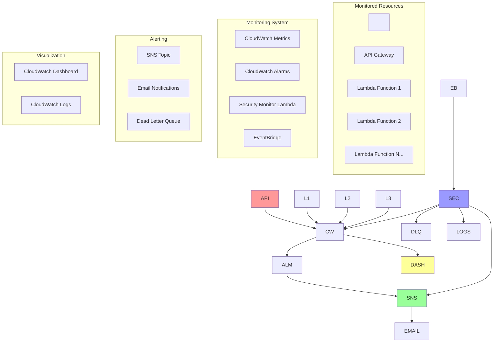

\# AWS Serverless API Monitoring System


\[!\[Terraform](https://img.shields.io/badge/Terraform-v1.0+-blue.svg)](https://www.terraform.io/)

\[!\[AWS](https://img.shields.io/badge/AWS-Cloud-orange.svg)](https://aws.amazon.com/)

\[!\[Python](https://img.shields.io/badge/Python-3.11-blue.svg)](https://www.python.org/)

\[!\[License](https://img.shields.io/badge/License-MIT-green.svg)](LICENSE)


A comprehensive, production-ready monitoring solution for AWS serverless APIs built with Terraform. This project demonstrates Infrastructure as Code (IaC) best practices while providing real-time monitoring, alerting, and security analysis for API Gateway and Lambda functions.


\## 🏗️ Architecture Overview





\## 🚀 Features


\### 📊 Comprehensive Monitoring

\- \*\*API Gateway Metrics\*\*: 4XX/5XX errors, latency, request count

\- \*\*Lambda Function Metrics\*\*: Errors, duration, throttles, invocations

\- \*\*Custom Security Monitoring\*\*: Automated threat detection and analysis


\### 🔔 Smart Alerting

\- \*\*Multi-tier Notifications\*\*: Email alerts with configurable thresholds

\- \*\*Security Alerts\*\*: Automated detection of potential attacks or abuse

\- \*\*Alert Categorization\*\*: Different severity levels (Warning, Critical)


\### 📈 Visualization \& Reporting

\- \*\*Real-time Dashboard\*\*: Professional CloudWatch dashboard

\- \*\*Historical Analysis\*\*: Trend analysis and pattern recognition

\- \*\*Detailed Logging\*\*: Comprehensive audit trail


\### 🔒 Security Features

\- \*\*Threat Detection\*\*: Automated analysis of error patterns

\- \*\*Attack Identification\*\*: Detection of brute force attempts, scanning, etc.

\- \*\*Security Alerting\*\*: Immediate notifications for suspicious activity


\## 🛠️ Technology Stack


\- \*\*Infrastructure\*\*: Terraform (>= 1.0)

\- \*\*Cloud Platform\*\*: AWS

\- \*\*Monitoring\*\*: CloudWatch, SNS, EventBridge

\- \*\*Compute\*\*: Lambda (Python 3.11)

\- \*\*Security\*\*: IAM roles with least-privilege access


\## 📋 Prerequisites


1\. \*\*AWS Account\*\* with appropriate permissions

2\. \*\*Terraform\*\* >= 1.0 installed

3\. \*\*AWS CLI\*\* configured with credentials

4\. \*\*Existing serverless API\*\* (API Gateway + Lambda functions)


\### Required AWS Permissions


```json

{

&nbsp;   "Version": "2012-10-17",

&nbsp;   "Statement": \[

&nbsp;       {

&nbsp;           "Effect": "Allow",

&nbsp;           "Action": \[

&nbsp;               "cloudwatch:\*",

&nbsp;               "sns:\*",

&nbsp;               "lambda:\*",

&nbsp;               "iam:\*",

&nbsp;               "events:\*",

&nbsp;               "sqs:\*",

&nbsp;               "logs:\*"

&nbsp;           ],

&nbsp;           "Resource": "\*"

&nbsp;       }

&nbsp;   ]

}

```


\## 🚀 Quick Start


\### 1. Clone and Configure


```bash

\# Clone the repository

git clone <repository-url>

cd aws-serverless-monitoring


\# Copy and customize configuration

cp terraform.tfvars.example terraform.tfvars

```


\### 2. Update Configuration


Edit `terraform.tfvars` with your specific values:


```hcl

\# Your API configuration

monitored\_api\_name = "my-production-api"

monitored\_lambda\_functions = \[

&nbsp; "api-auth-handler",

&nbsp; "api-data-processor"

]


\# Alert configuration  

alert\_email = "alerts@yourcompany.com"

api\_error\_threshold = 5

```


\### 3. Deploy Infrastructure


```bash

\# Initialize Terraform

terraform init


\# Review the deployment plan

terraform plan


\# Deploy the monitoring system

terraform apply

```


\### 4. Confirm Email Subscriptions


Check your email and confirm the SNS subscription(s) to start receiving alerts.


\## 📊 Monitoring Capabilities


\### API Gateway Monitoring


| Metric | Threshold | Alert Level |

|--------|-----------|-------------|

| 4XX Errors | Configurable (default: 5) | High |

| 5XX Errors | Any occurrence | Critical |

| High Latency | > 5 seconds | Medium |


\### Lambda Function Monitoring


| Metric | Threshold | Alert Level |

|--------|-----------|-------------|

| Errors | Any occurrence | High |

| Duration | Configurable (default: 10s) | Medium |

| Throttles | Any occurrence | High |


\### Security Monitoring


\- \*\*Automated Analysis\*\*: Runs every 15 minutes (configurable)

\- \*\*Threat Detection\*\*: Identifies potential attacks based on error patterns  

\- \*\*Attack Types Detected\*\*:

&nbsp; - Brute force attempts (401/403 errors)

&nbsp; - API scanning (404 errors)  

&nbsp; - Authentication bypass attempts

&nbsp; - DDoS patterns


\## 🔧 Configuration Options


\### Environment Variables


The system supports multiple deployment environments:


```hcl

\# Development

environment = "dev"


\# Staging  

environment = "staging"


\# Production

environment = "prod"

```


\### Alert Thresholds


Fine-tune monitoring sensitivity:


```hcl

\# Conservative monitoring (fewer alerts)

api\_error\_threshold = 10

lambda\_duration\_threshold\_ms = 15000

security\_error\_threshold = 20


\# Aggressive monitoring (more sensitive)

api\_error\_threshold = 2

lambda\_duration\_threshold\_ms = 5000  

security\_error\_threshold = 5

```


\### Feature Flags


Control what gets deployed:


```hcl

enable\_security\_monitoring = true   # Deploy security Lambda

enable\_dashboard = true             # Create CloudWatch dashboard

enable\_detailed\_monitoring = false  # Enable detailed metrics (costs more)

```


\## 📈 Dashboard and Visualization


The CloudWatch dashboard provides:


\- \*\*Real-time Metrics\*\*: Live view of API and Lambda performance

\- \*\*Historical Trends\*\*: Performance patterns over time

\- \*\*Error Analysis\*\*: Detailed breakdown of error types

\- \*\*Cost Optimization\*\*: Insights for resource optimization


Access your dashboard at:

```

https://<region>.console.aws.amazon.com/cloudwatch/home?region=<region>#dashboards:name=<project>-<env>-monitoring

```


\## 🔒 Security Considerations


\### IAM Roles and Policies


The system implements least-privilege access:


\- \*\*Security Monitor Role\*\*: Limited to CloudWatch read and SNS publish

\- \*\*Lambda Execution Role\*\*: Minimal permissions for logging and metrics

\- \*\*Cross-Account Protection\*\*: Prevents unauthorized access


\### Data Protection


\- \*\*Encryption\*\*: SNS topics use AWS managed encryption

\- \*\*Audit Trail\*\*: All actions logged to CloudWatch

\- \*\*Access Control\*\*: IAM policies restrict resource access


\## 💰 Cost Estimation


\### Monthly Costs (Typical Usage)


| Service | Usage | Cost |

|---------|--------|------|

| CloudWatch Alarms | ~10 alarms | $1.00 |

| CloudWatch Dashboard | 1 dashboard | $3.00 |

| Lambda Invocations | ~3,000/month | $0.60 |

| SNS Notifications | ~100/month | $0.05 |

| \*\*Total\*\* | | \*\*~$4.65/month\*\* |


\### Cost Optimization Tips


1\. \*\*Adjust monitoring frequency\*\*: Reduce security monitoring from 15min to 1hr

2\. \*\*Disable dashboard\*\*: Set `enable\_dashboard = false` to save $3/month

3\. \*\*Optimize thresholds\*\*: Reduce false positives to minimize SNS costs

4\. \*\*Use free tier\*\*: First 10 CloudWatch alarms are free


\## 🚨 Troubleshooting


\### Common Issues


\#### No Alerts Received

```bash

\# Check SNS subscription status

aws sns list-subscriptions-by-topic --topic-arn <topic-arn>


\# Verify email confirmation

\# Check spam folder for confirmation email

```


\#### Lambda Function Errors

```bash

\# View Lambda logs

aws logs tail /aws/lambda/<function-name> --follow


\# Test function manually

aws lambda invoke --function-name <function-name> response.json

```


\#### Missing Metrics

```bash

\# Verify target resources exist

aws apigateway get-rest-apis --query 'items\[?name==`your-api-name`]'

aws lambda list-functions --query 'Functions\[?FunctionName==`your-function`]'

```


\### Debug Commands


```bash

\# View all alarms

terraform output useful\_commands


\# Check alarm states

aws cloudwatch describe-alarms --state-value ALARM


\# Test security monitoring

aws lambda invoke --function-name <security-function> test-response.json

```


\## 🔄 Operational Procedures


\### Regular Maintenance


1\. \*\*Weekly\*\*: Review dashboard for trends and anomalies

2\. \*\*Monthly\*\*: Adjust thresholds based on traffic patterns  

3\. \*\*Quarterly\*\*: Review and optimize costs

4\. \*\*Annually\*\*: Update Terraform and AWS provider versions


\### Incident Response


1\. \*\*Receive Alert\*\*: Check email/SNS notification

2\. \*\*Assess Severity\*\*: Review alert details and dashboard

3\. \*\*Investigate\*\*: Use CloudWatch Logs and AWS Console

4\. \*\*Resolve\*\*: Address root cause

5\. \*\*Post-Mortem\*\*: Update thresholds if needed


\## 🤝 Contributing


This project demonstrates professional DevOps practices. Contributions should follow:


1\. \*\*Infrastructure as Code\*\*: All changes via Terraform

2\. \*\*Testing\*\*: Validate with `terraform plan` before applying

3\. \*\*Documentation\*\*: Update README for significant changes

4\. \*\*Security\*\*: Follow AWS security best practices


\## 📄 License


This project is licensed under the MIT License - see the \[LICENSE](LICENSE) file for details.


\## 🏆 Project Highlights


This monitoring system demonstrates several key DevOps and AWS skills:


\- \*\*Infrastructure as Code (IaC)\*\* with Terraform

\- \*\*AWS Native Services\*\* integration

\- \*\*Security-First Approach\*\* with automated threat detection

\- \*\*Production-Ready Code\*\* with error handling and logging

\- \*\*Cost Optimization\*\* considerations

\- \*\*Operational Excellence\*\* with comprehensive monitoring


Perfect for showcasing cloud engineering capabilities in interviews and portfolio reviews.


---


\*\*Built with ❤️ for the AWS community\*\*


\*This project serves as a practical example of professional AWS infrastructure automation and monitoring practices.\*

